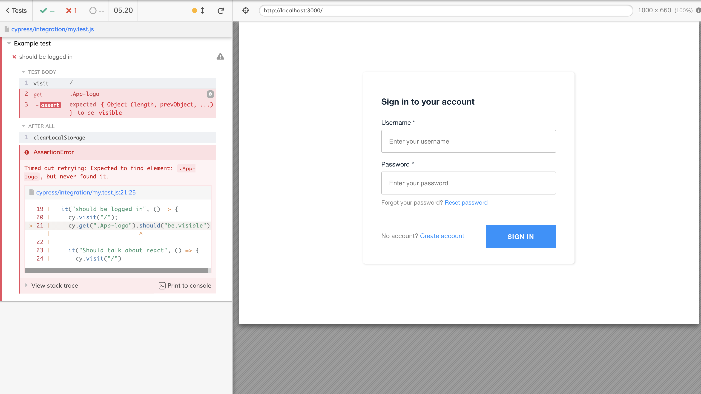

# Cypress AWS Amplify Auth Example

This project contains an example of how to test an Amplify application that is protected with authentication from a Cognito User Pool.  
After this you'll no longer have to worry about signing in through the UI before every single one of your tests.

From having to authenticate before each test:




To being signed in and flawlessly test:


Setup the Amplify project:

```
amplify init
amplify push
amplify publish
```

## Cypress tests

Configure Cypress:

- add `cypress.env.json`
- Update `cypress.env.json`.
  You can find `userPoolId` and `clientId` in `aws-exports.js` (in src directory after executing `amplify push`).
  Add:

```
{
  "username": "yourUserName",
  "password": "yourPassword",
  "userPoolId": "yourUserPoolId",
  "clientId": "yourClientId"
}

```

- In one terminal start the app: `npm start`
- In another terminal run: `npm run cypress:open`
- Choose the spec you want to run
